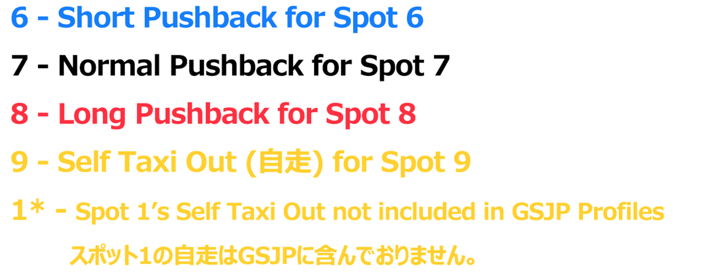

# GroundServicesJP 
## 概要 Overview
GroundServicesJP “GSJP”は、MicrosoftFlightSimulatorでの日本国内における空港の地上サービスや設(GSE)を再現するために開始されたプロジェクトで、github.comを拠点とするオープンソースプロジェクトです。 

GSJPプロジェクトの4つの目標： 
1. 空港車両の配置、乗客の乗降経路設定、プッシュバック位置の設定、機体の停止位置設定をGSX Pro用プロファイルとして作成する (MSFS限定の機能) 。  
2. GSXを使用せずにプッシュバックをする方など、全ユーサー向けのプッシュバックマップを作成する。  
3. github.comのプロジェクトページを訪問することなく、GSJPにて作成されたプロファイルのダウンロードやアップデートを行えるソフトウェアの開発を行う(実装までしばらくお待ち下さい)。  
4. GSXの空港車両などを現実の塗装に合わせる(実装までしばらくお待ち下さい)。

GroundServicesJP (GSJP) aims to improve Ground Services Equipment (GSE) in Japan on MSFS. The open-sourced project is hosted on github.com.  
The project has four objectives:  
1. GSX Pro profiles that include correct positioning of GSE vehicles, PAX Waypoints, pushback/stop locations. This feature is for MSFS only.  
2. Pushback maps for all users (including ones who do not use GSX).  
3. A software that organizes and updates various GSX profiles, so users do not have to come to github and download releases. This feature will come later.  
4. Updated GSX GSE vehicle textures to reflect the real condition. This feature will come later.

## プッシュバックマップ  Pushback Map
### お知らせ Notice
プッシュバックマップは、多くの空港を作成するために多くの時間を要するため、簡易的な手書きマップとなっております。この先私たちの時間が取れるようになった段階で、見た目を改善したマップを作成する予定です。 

また、一つ一つの空港を実際に訪問し、ATCを聴くなどして状況を把握しきることはできないため、リアルさを欠くプロファイルを作成してしまう可能性があります。 

もし、こちらをご覧の方で、現実世界で地元の空港に行きATCやプッシュバックの行い方の情報を得る事ができる方がいらっしゃいましたら、私達に情報をお寄せください。 

Currently, the Pushback Maps are handwritten because creating maps for many airports would take a lot of time. We will create better-looking maps when we have time.   

We cannot really visit every airport in real life and check their ATC communications. Therefore, the profiles we give may be inaccurate. Please supply us with information (ATC communication, pushback types) about your local airport if you have it. Let us work together to bring your home airport to real life.  

### 凡例  Legend
#### カラー数字 Colored Numbers
プッシュバック種類は、実際のATC用語です。 These pushback types are real conditions used by ATC in their phraseology.  

#### 記号 Symbols 

### 完成した空港  Finished Airports
| 空港 Airport              |
| ------------------------ |
| 釧路 Kushiro (RJCK)       |
| 広島 Hiroshima (RJOA)     |
| 秋田 Akita (RJSK)         |
| 北九州 Kita-Kyushu (RJFR) |
| 松山 Matsuyama (RJOM)     |

